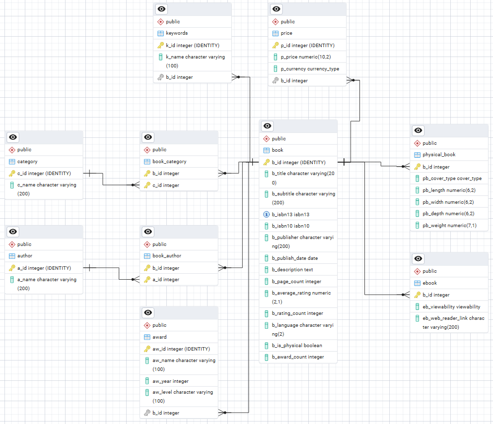
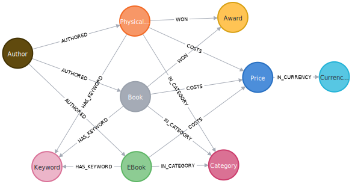

# About

This project demonstrates the implementation of both relational (PostgreSQL) and graph-based NoSQL (Neo4j) database paradigms, showcasing advanced data modeling, API integration, and database migration techniques.

## Key Features

- **Dual API Integration:** Engineered a robust data collection pipeline that fetches and merges book data from the Penguin Random House and Google Books APIs, handling rate limiting and request failures gracefully
- **Large-Scale Data Management:** Successfully processed and stored data for over 120,000 books (~500mb) with comprehensive metadata
- **Complex Data Modeling:**
  - **PostgreSQL:** Implemented database patterns including IS-A relationships, weak entities, and complex referential integrity constraints
  - **Neo4j:** Developed an optimized graph structure for representing book relationships and metadata, with performance-tuned indexing
- **Advanced Query Optimization:** Created and benchmarked various database indexes, demonstrating significant performance improvements (up to 50x faster for certain queries)
- **Role-Based Access Control:** Implemented view-based security measures to control data access based on user privileges

## Technical Highlights
- Built with Python, PostgreSQL, Neo4j, Docker
- Implemented transaction-based data operations for fault tolerance
- Developed intelligent retry mechanisms for API rate limiting
- Utilized database-specific optimization techniques:
  - PostgreSQL: Triggers, materialized views, complex joins
  - Neo4j: Full-text search indexes, relationship-based queries

## Team Members

| Name            | Student ID |
| --------------- | ---------- |
| Nathan Grenier  | 40250986   |
| Nathanial Hwong | 40243583   |

## Data Models
Below are the data model diagram of each database.

### Relational Database (Postgres)

<div align="center">
  
</div>

### NoSQL Database (Neo4j)

<div align="center">
  
</div>

## Project Report

A report providing deeper insight into the project can be found [here](https://1drv.ms/w/c/4791e2766e02f96f/Eej5VmPHaGRDkwL-A2vhkeABtMbsq8oq80RLVk7jk529Cw?e=Tdd32G). 

## Relational Database Data Dump File

The Postgres data dump file can be found either:
- In the project at `src/data/data_backup.sql`
- Online at https://mega.nz/file/cglF1T6S#nCY-0kH13lLYo-R3SqO5ZI7Z-yf0qlQJFOas8_FL5I0
  > Note: Mega Upload might have messed up the character encoding of the `data_dump.sql` file.

# Contributing 

## Setting Environment Variables
Set these env variables before running any commands:

Relational Database:
- POSTGRES_DB
- POSTGRES_USER
- POSTGRES_PASSWORD
> Look in the `docker-compose.yaml` for the db credentials

Neo4j (Graph Database):
- NEO4J_PASSWORD

API: 
- RANDOMHOUSE_API_KEY

## Using Docker 
### PostgreSQL Container
> You should [install docker](https://docs.docker.com/engine/install/) for you system before starting.

Both the Postgres instance and database management tool (pgAdmin) are configured in the `docker-compose.yml` file.

1. To run both services, use `docker compose up`.
    > You can run the container in "detached" mode by appending the `-d` flag to the command above.
2. Next, check that both services are running with `docker ps`.
3. Copy the "postgres" services docker id (ex: 1fc60e0e538d).
4. Inspect the details of the postgres container using `docker inspect {postgres id}`.
5. Search for the `IPAddress` attribute of the postgres database and keep note of it.
6. Open `http://localhost:5050/` to view the pgAdmin webpage.
7. Click on the "Add New Server" Quick Link in pgAdmin to add the postgres instance.
8. In the General tab: 
   - Give the postgres server a name.
    > 
9. In the Connection Tab: 
   - Enter the postgres container's ip address
   - Enter the same username as in the `.env` file (POSTGRES_USER) 
   - Enter the same password as in the `.env` file (POSTGRES_PASSWORD)
    > 

### Neo4j Container
The neo4j browser, an interactive window to run queries and visualize database data, can be accessed at <http://localhost:7474/browser/> after running `docker compose up`.

> Make sure to set the appropriate environment variables in your `.env` file.
## Using plantUML

In order to render ER diagrams (chen's notation), you must use the [server version](https://github.com/qjebbs/vscode-plantuml?tab=readme-ov-file#use-plantuml-server-as-render) of plantUML.

### Setup
To pull the docker image, run:
```bash
docker run -d -p 8181:8080 --name plantuml -e BASE_URL=plantuml plantuml/plantuml-server:jetty
```

Add the following settings to your `setting.json` file in VsCode:
```json
  "plantuml.server": "http://localhost:8181/plantuml",
  "plantuml.render": "PlantUMLServer",
```

> Note: You can change the host's port (port before the ":") to whatever you'd like. Default for http is usually `80` or `8080` 

### Useful Commands

- Start the container: `docker start {name}`
- Stop the container: `docker stop {name}`
- List all running containers: `docker ps` 

### Exporting
To specify where the diagrams should be defined and exported, add the following to VsCode's `setting.json`:

```json
  "plantuml.diagramsRoot": "diagrams/src",
  "plantuml.exportOutDir": "diagrams/out",
```

## Python Venv

First, install virtualvenv using `pip install virtualenv`.

Now, you can create a venv to work in using `virtualenv --python 3.12.1 venv`

> Note: You need the specified version on python installed on your local computer to run the command above

### Working in the venv

In order to activate the venv to start working in it, use this command:

```bash
# Linux and Mac
source venv/bin/activate

# Windows
.\venv\Scripts\activate
```

To stop working in the venv, use the command: `deactivate`.

### Installing Project Dependencies

Use the following command while in the venv to install the project's dependencies:

```bash
pip install -r requirements.txt
```

## Dumping PostgreSQL Database

You can generate a data dump of your postgres database by using the following command: `pg_dump -U postgres -d db -f data_backup.sql --data-only --column-inserts`.

### Populating Postgres with a Data Dump File
In order to populate your database with data, you'll need to either run the code (which will take a long time), or download and import the data dump file in the postgres docker container through the command line.

Follow the steps below to populate your postgres database (in docker):
1. `docker cp /path/to/your/local/data_dump.sql postgres:/tmp/data_dump.sql`
2. `docker exec -it postgres bash`
3. From the bash terminal instance, run: `psql -U postgres -d db < /tmp/data_dump.sql`

If `psql` isn't installed in the container, try these alternatives:
1. Install psql in the container: `apt-get update && apt-get install -y postgresql-client`
2. Use `psql` from your environment: `docker exec -i postgres psql -U postgres -d db < /path/to/your/local/data_dump.sql`

## Code Formatting and Linting

I like using Ruff to format and lint my python code. This package is installed whenever you [install the project's dependencies](#installing-project-dependencies) and can be used with the following command:

```bash
ruff format .
```

If you want the file to format on save, you can install the VsCode Ruff extension and add these lines to VsCodes' `setting.json` file:

```json
{
  "notebook.formatOnSave.enabled": true,
  "notebook.codeActionsOnSave": {
    "notebook.source.organizeImports": "explicit"
  },
  "[python]": {
    "editor.formatOnSave": true,
    "editor.codeActionsOnSave": {
      "source.organizeImports": "explicit"
    },
    "editor.defaultFormatter": "charliermarsh.ruff"
  }
}
```
